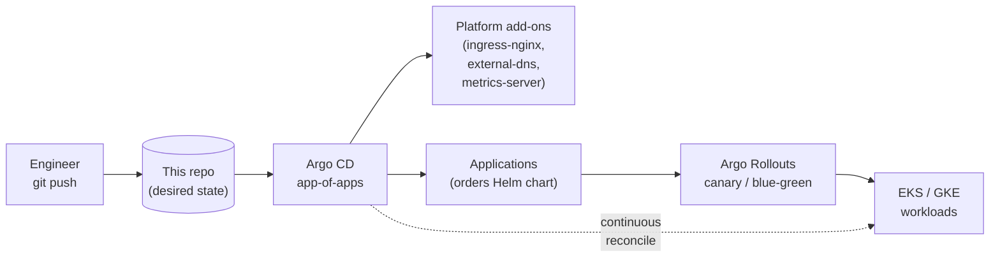

# kubernetes-gitops-argocd

[](https://argo-cd.readthedocs.io/)
[](https://kubernetes.io/)
[](https://helm.sh/)
[](LICENSE)

A GitOps reference repository for Kubernetes using **Argo CD** (app-of-apps) and
**Argo Rollouts** for progressive delivery. Demonstrates how I run cluster
add-ons and application workloads declaratively, with **canary** and **blue-green**
release strategies and controlled traffic shifting.

> Maps to my SRE work operating EKS/GKE: Helm + Argo CD deployments, autoscaling,
> and safer production releases through progressive delivery.

## How it works



Argo CD watches this repo and reconciles the cluster to match. The **root**
Application (`bootstrap/root-app.yaml`) renders every Application under
`apps/` and `platform/`  the *app-of-apps* pattern  so a single `kubectl apply`
bootstraps the whole platform.

## Repo layout

```
bootstrap/        # root Application (app-of-apps) + Argo CD project
platform/         # cluster add-ons as Argo CD Applications
apps/
  orders/
    chart/        # Helm chart for the sample "orders" service
    rollout/      # Argo Rollouts canary + blue-green variants
    overlays/     # Kustomize dev / prod overlays
```

## Progressive delivery

| Strategy | File | Behaviour |
|----------|------|-----------|
| Canary | `apps/orders/rollout/canary.yaml` | 10% → 25% → 50% → 100% with analysis pauses |
| Blue-Green | `apps/orders/rollout/bluegreen.yaml` | Full preview stack, promote after smoke check |

Canary steps are gated by an `AnalysisTemplate` that queries Prometheus for the
service success rate and **auto-aborts** the rollout if it drops below 99%.

## Bootstrap

```bash
# 1. Install Argo CD + Argo Rollouts (once per cluster)
kubectl create namespace argocd
kubectl apply -n argocd -f https://raw.githubusercontent.com/argoproj/argo-cd/stable/manifests/install.yaml
kubectl apply -n argo-rollouts -f https://github.com/argoproj/argo-rollouts/releases/latest/download/install.yaml

# 2. Point Argo CD at this repo (app-of-apps)
kubectl apply -f bootstrap/project.yaml
kubectl apply -f bootstrap/root-app.yaml

# 3. Watch everything sync
argocd app list
kubectl argo rollouts get rollout orders -n orders --watch
```

## Validation

`.github/workflows/validate.yml` runs `kubeconform` against every manifest and
`helm lint` + `helm template` on the chart on each PR.

## License

MIT © Ayushi Shrotriya
